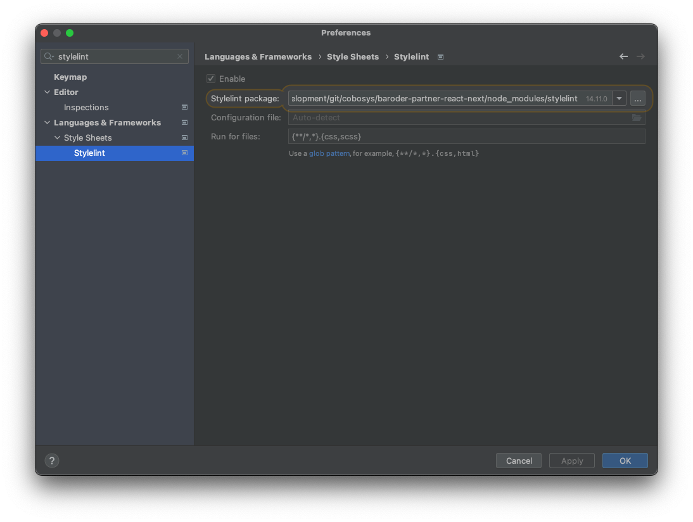

# 목차
- [1. 프로젝트 구성](#1.-프로젝트-구성)
- [2. IDE, 개발환경 설정](#2.-IDE,-개발환경-설정)
- [3. 프로젝트 설정](#3.-프로젝트-설정)
- [4. 배포](#4-배포)
---

**문서 작성일 : 2023년 5월 17일**

# 1. 프로젝트 구성
## next.js 13.4.1
next.js 13 문서
https://nextjs.org/docs

## typescript
개발언어로 typescript 를 사용한다.

## nextjs 13 App Router 적용
nextjs 13 App Router 를 사용한 방식으로 구현되어 있다. 작성된 코드는 별도의 설명이 없다면 App Router 기반에서의 동작을 의미한다.

## Client Component 와 Server Component 간의 데이터 전달에 대하여
문서 작성일을 기점으로 Client Component 와 Server Component 간의 데이터 전달할 수 있는 가이드라인이 없다. 따라서 예제에서는 cookie 를 이용하여 처리하도록 작성되어 있다.

## MSW
MSW 라이브러리를 이용한 API Mocking 을 적용하였다.

npm : https://www.npmjs.com/package/msw

env 내의 `NEXT_PUBLIC_API_MOCKING` 속성을 `enable`로 설정하고, NODE_ENV 가 `development` 일 때 동작한다.

### nextjs 13 App Router 에서의 MSW 사용
nextjs 13 에서는 App Router 를 사용할 때 서버 컴포넌트에서는 MSW의 serviceWorker 타입이 동작하지 않는다. serviceWorker 에서는 클라이언트 사이드에서만 동작한다.

MSW serviceWorker 는 초기화는 `ClientComponent`에 구현되어 있으며, MSW serviceWorker를 사용하려면 사용하고자 하는 컴포넌트를 `ClientComponent`로 래핑해야 한다. 

```typescript jsx
export default function TestPage() {
    return (
        <div>
            <ClientComponent>
                <LoginForm />
            </ClientComponent>
        </div>
    );
}
```

## ajv
json 데이터를 직렬화하여 데이터 모델 객체를 생성할 때 `ajv`를 이용하여 json 데이터의 검증을 수행한다.

```typescript
export class UserAuthentication {
    private _userId = '';

    private _accessToken = '';

    private _refreshToken = '';

    static fromJson(json: object): UserAuthentication {
        const avj = new Avj();
        const validate = avj.compile(schema);
        if (!validate(json)) {
            throw new ServiceResponseInvalidJsonError(validate.errors);
        }

        const instance = new UserAuthentication();
        instance.userId = json.userId as string;
        instance.accessToken = json.accessToken as string;
        instance.refreshToken = json.refreshToken as string;
        return instance;
    }

    // 이하 생략
}
```

## style
3가지의 style 라이브러리가 적용되어 있다.
- scss
- styled-components
- tailwindCSS

### tailwindCSS와 다른 스타일 라이브러리와의 상호운용성
tailwindCSS 와 다른 스타일 라이브러리를 혼용하여 사용하는 경우에 CSS 주입 순서의 오류로 인하여 원하지 않는 렌더링 결과를 얻을 수 있다.

스타일 라이브러리의 특성마다 이 부분에 대하여 설정이 필요하다.

mui 라이브러리에 대해서는 아래 문서를 참조하여 이 부분을 해결하였다.

mui 가이드 문서

https://mui.com/material-ui/guides/interoperability/#tailwind-css

# 2. IDE, 개발환경 설정
## stylelint
사용하는 IDE에서 stylelint를 설정해야 한다.

아래는 WebStorm IDE에서의 설정이다.


## [eslint] Delete 'cr' [prettier/prettier] 이슈
`eol`을 `native`로 설정합니다.
```shell
git config --global core.eol native
```

macOS, linux `autocrlf` 를 `input`으로 설정합니다.
```shell
git config --global core.autocrlf input
```

windows 에서는 `autocrlf` 를 `auto`으로 설정합니다.
```shell
git config --global core.autocrlf auto
```

참조 : https://developpaper.com/solution-to-delete-%E2%90%8Deslint-prettier-prettier-error/

# 3. 프로젝트 설정
## Install Tailwind CSS with Next.js
참조 : [공식문서 (Install Tailwind CSS with Next.js) ](https://tailwindcss.com/docs/guides/nextjs)

# 4. 배포
프로젝트 루트 경로의 docker 디렉토리 하위에 배포를 위한 파일이 작성되어 있다.

Nextjs 는 [PM2](https://www.npmjs.com/package/pm2) 프로세스 매니저를 통해 실행되도록 구성되어 있다. 2개의 docker 이미지를 생성하여 배포한다.
- application : nextjs + pm2 복합 구성
- nginx : nginx 웹서버의 reverse proxy 역할

`docker/dev` 경로에는 개발서버 배포용을 의미하며, `docker/production` 경로에는 운영서버 배포용을 의미한다.

## Nextjs 배포

`Dockerfile-pm2-dev` 에 docker build가 정의되어 있다.

## Nginx 배포

`Dcokerfile-nginx-dev` 에 docker build가 정의되어 있다. 

`nginx.conf`, `nginx-app.conf` 파일은 nginx docker 이미지 빌드 시 적용된다.

## jenkins

ci/cd 를 위한 jenkins 파이프라인 스크립트가 작성되어 있다. 배포 파이프라인은 아래의 과정을 수행한다.
1. git 저장소 clone 
2. 빌드 서버의 빌드될 예정의 docker image 삭제 
3. docker build
4. docker save
5. 배포대상 서버에 docker image file 업로드
6. 배포대상 서버의 생성된 구버전의 docker 컨테이너 및 이미지 삭제
7. 신규 docker image load 및 컨테이너 생성
